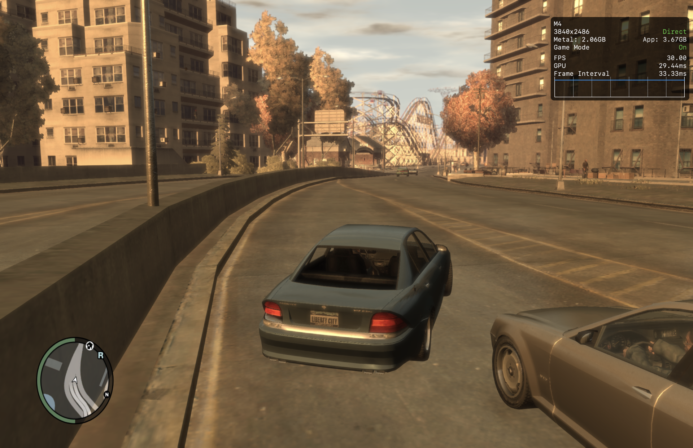

<p align="center">
    
</p>

---

> [!CAUTION]
> This is a personal, work-in-progress fork. It is in early development and is NOT meant for public use.

**Liberty Recompiled, PAL and macOS edition.** This repository is a fork of
[OZORDI/LibertyRecomp](https://github.com/OZORDI/LibertyRecomp), the unofficial PC port of the
Xbox 360 version of Grand Theft Auto IV created through static recompilation. The fork changes the
project's target in two ways:

- **It runs from the PAL disc, not the US one.** Upstream recompiles the USA release (media ID
  `0x6AC07221`, Title Update 8). This fork recompiles the **PAL (NZ/AU/EU)** release (media ID
  `0x7CF4679F`, base version 7) with **Title Update 5**. The PAL build is a different compile of the
  game, so every hard-coded guest address was remapped; see [docs/PAL-PORT.md](docs/PAL-PORT.md).
- **It is developed and tested on macOS (Apple Silicon) with the native Metal renderer.** Windows and
  Linux are not built or tested here. Upstream remains the place for those platforms.

**This project does not include any game assets. You must provide the files from your own legally
acquired copy of the game to install or build Liberty Recompiled.**

The runtime is powered by a fork of the [ReXGlue SDK](https://github.com/rexglue/rexglue-sdk), which
handles PowerPC → C++ recompilation and Xenos shader translation. The development of static
recompilation tooling in this space was directly inspired by
[N64: Recompiled](https://github.com/N64Recomp/N64Recomp).

## Table of Contents

- [What is different in this fork](#what-is-different-in-this-fork)
- [Status](#status)
- [Installation](#installation)
- [Settings and performance](#settings-and-performance)
- [Mouse and trackpad](#mouse-and-trackpad)
- [Building on macOS](#building-on-macos)
- [Mod Support](#mod-support)
- [Documentation](#documentation)

## What is different in this fork

| Area | Upstream | This fork |
|---|---|---|
| Game release | USA disc, Title Update 8 | **PAL disc, Title Update 5** (`LIBERTY_RECOMP_PAL=ON`, builds `generated_pal/`) |
| Platforms | Windows, Linux, macOS | **macOS Apple Silicon** only (macOS 26, Homebrew LLVM) |
| Default renderer | `gta4-native` (Vulkan via MoltenVK) | **`gta4-metal`**, the native Metal renderer. The MoltenVK path hits "graphics device lost" on the PAL build |
| Shader cache | US shaders | US cache plus the 24 PAL executable-embedded shaders (Bink video etc.); pipelines are recorded and precompiled into a Metal binary archive at launch |
| Installer | US media ID and TU8 hashes | PAL media ID, region, base hash and TU5 hashes; the US pre-patched shortcut is inert |
| UI | Green Xenia-style ImGui | GTA IV-style theme: black panels, DIN type, amber accent, across the installer, chat and overlays |
| Diagnostics | Native profiler | Per-frame Metal timing CSV, GPU pass profiler, presenter trace, stutter capture tooling in `tools/perf/` |
| Mouse / trackpad | Hold-RMB aim; camera re-centres after mouse look | Trackpad-aware input: mouse look holds the camera, tap-to-toggle aim on a trackpad, a keyboard aim key (Option), all in the pause-menu settings |

Address matching, remapping and the XEX/TU tooling that made the PAL port possible live in
`tools/xex/` (see its README).

## Status

- The PAL build boots, installs through the PAL installer, plays the opening cutscene and free-roam
  on `gta4-metal`.
- Frame pacing work on 2026-10-10 removed a once-per-second main-thread stall (IOKit HID inventory),
  stopped a hidden window from dropping to 4 fps, and found that rendering at the 2× backing store
  of a scaled display mode was the main GPU cost. Dense city traffic still sits around 30 fps.
- Known PAL gaps are listed at the end of [docs/PAL-PORT.md](docs/PAL-PORT.md): a few data addresses
  are still US values (cloud/timecycle selection may misbehave) and some hooks sit on functions TU5
  changed.
- Everything upstream lists as complete (audio, saves, input, VFS, multiplayer stubs, FusionFix
  overlays) is carried over, but only the macOS + Metal path is exercised here.

## Installation

Install directory on macOS: `~/Library/Application Support/LibertyRecomp/`
(`game/`, `saves/`, `shader_cache/`, `native.toml`, `perf/`).

### Game files required

You need a legal **PAL** copy of GTA IV for Xbox 360 plus its Title Update 5. The installer checks
the media ID, region and hashes, and rejects the US release.

| Input | What to provide |
|---|---|
| Base game | PAL disc image (`.iso`), an extracted disc folder, or an XContent package |
| Title Update 5 | The `default.xexp` from the console's `Content/0000000000000000/545407F2/000B0000/`, or the STFS package containing it. A disc-only dump is rejected |
| Episodes | Optional: The Lost and Damned / The Ballad of Gay Tony XContent packages |

See the [Dumping Guide](docs/DUMPING-en.md) for extraction and `tools/xex/README.md` for how the
disc and TU were obtained and verified for this fork.

### Launch arguments

Every setting in `native.toml` can be passed as `--name=value`. Useful ones:

| Argument | Description |
|---|---|
| `--install` | Force reinstallation (the installer screen) |
| `--install_dlc` | Install episodes only |
| `--install_check` | Verify file integrity |
| `--gpu_plugin=gta4-metal` | Renderer (`gta4-metal`, `gta4-native`, `xenos`); restart required |
| `--resolution=1440p` | Render resolution preset; `--video_mode_width/height` for an exact size |
| `--gta4_performance_hud=true` | Apple's Metal Performance HUD (fps, GPU time, frame graph) |
| `--diagnostics=true --diagnostics_categories=logging,presenter` | Text log plus the presenter/frame-pacer trace |

## Settings and performance

- **Render resolution.** Upstream renders at the display's full backing store, which on a scaled
  retina mode ("looks like 1920×1243") is 3840×2486, more pixels than the 2880×1864 panel has. This
  fork caps the automatic size at the panel's native pixels (`gta4_native_panel_resolution_cap`,
  on by default). For more headroom, `resolution = "1440p"` in `native.toml` (the same choice as
  Settings > Resolution in game) renders at 2224×1440 at the display aspect; on the M4 that cut
  GPU time per frame from 33 ms to 20 ms.
- **Anti-aliasing is cheap.** SMAA costs about 2.5 ms per frame at full size; it is not the
  bottleneck.
- **Xbox 360 parity preset.** The port raises draw distance, shadows, population and reflections
  above the original. `tools/perf/play_preset.sh xbox360-parity` launches with the original values
  without touching your config.
- **Capturing a stutter.** `tools/perf/capture_stutter.sh` launches with diagnostics on and writes a
  per-frame CSV, a GPU pass CSV and the game log into one folder per session under `perf/`.
  `tools/perf/summarize_frames.py <frames.csv>` prints fps, percentiles and 5-second windows.
- **Hotkeys.** F3 debug overlay, backtick console, F4 settings, F7 achievements, Y / U text chat.

## Mouse and trackpad

The port drives the retail cameras directly with mouse displacement rather than emulating a stick.
Two things made that awkward on a MacBook trackpad and were fixed on 2026-10-10:

- **Camera no longer drifts back to centre after looking around.** The retail cameras decide
  "stick released" from the stick's dead-zone test before the mouse rotation is applied, so with a
  mouse they always re-centred as if the stick had just been let go. Recent mouse or trackpad
  motion now counts as a held stick for that decision (on foot, gameplay, aim and vehicle follow
  cameras) for `gta4_mouse_look_hold_seconds` (default 2 s). Setting: **Mouse Look Hold**.
- **Aiming without holding a secondary click.** A trackpad can't hold a two-finger click and move,
  so aim is tap-to-toggle whenever the last look input came from a trackpad
  (`gta4_trackpad_aim_toggle`, on by default), and a keyboard key aims like RMB
  (`gta4_keyboard_aim_key`, default **Option**; Tab, Caps Lock, Z, X or none). Fire stays on click
  or tap. Settings: **Trackpad Aim**, **Keyboard Aim Key**, plus the existing **Mouse Aim**
  hold/toggle for a mouse.

Mouse and trackpad aim is free aim with no target lock, as on the PC release; the toggle engages
only for weapons that free-aim (fists and melee stay held lock-on). All of these are rows on the
pause menu's Liberty settings page and in the F4 overlay under GTA IV / Input.

## Building on macOS

Requirements: macOS 26 with Xcode and the Metal toolchain
(`xcodebuild -downloadComponent MetalToolchain`), and
`brew install cmake ninja llvm spirv-cross glslang`.

```bash
git clone https://github.com/hamishakl/LibertyRecomp.git
cd LibertyRecomp
python3 tools/setup_repo.py
cmake --preset macos-release -DCMAKE_OSX_DEPLOYMENT_TARGET=26.0
cmake --build --preset macos-release --target LibertyRecomp
open "out/build/macos-release/LibertyRecomp/Liberty Recompiled.app"
```

Setup fetches the pinned dependencies and applies the required source patches. After pulling:

```bash
git -c submodule.recurse=false pull --ff-only
python3 tools/setup_repo.py
```

The PAL recompilation is generated from your own PAL `default.xex` + `default.xexp`; the pipeline
(`rexglue codegen`, `tools/xex/match_functions.py`, `remap_sources.py`, `build_pal_config.py`) is
described in [docs/PAL-PORT.md](docs/PAL-PORT.md). See [docs/BUILDING.md](docs/BUILDING.md) for
presets, memory-limited builds and the `from_chars` deployment-target error.

## Mod Support

FusionFix-style file overlays are carried over from upstream: files placed under `update/` next to
the game data override base files, mirroring the game's folder structure. Only the `update:` mount is
implemented in this fork; the priority table in [docs/MOD_SUPPORT.md](docs/MOD_SUPPORT.md) is
upstream's design.

## Documentation

| Document | Description |
|---|---|
| [PAL port](docs/PAL-PORT.md) | Plan, status, known gaps and lessons from the US → PAL port |
| [Dev notes](docs/DEV-NOTES.md) | Map of the codebase for macOS work: boot flow, hooks, renderers, tools |
| [Building Guide](docs/BUILDING.md) | Build presets and macOS troubleshooting |
| [Dumping Guide](docs/DUMPING-en.md) | Extracting game files from an Xbox 360 |
| [XEX tools](tools/xex/README.md) | XEX extraction, title-update application, US/PAL comparison |
| [Mod Support](docs/MOD_SUPPORT.md) | FusionFix-compatible overlays |
| [Installation Architecture](docs/INSTALLATION_ARCHITECTURE.md) | Platform paths and install flow |
| [Online Multiplayer Guide](docs/ONLINE_MULTIPLAYER.md) | Online play setup (untested in this fork) |

## Performance comparison

This fork, free-roam driving on a **MacBook Air (Apple M4, 16 GB, macOS 26.6)** with the native Metal
renderer, `resolution = "1440p"` and the port's default draw-distance/population settings. The
overlay is Apple's Metal Performance HUD (`gta4_performance_hud = true`). Its resolution line is the
Metal layer the frame is presented on (the display's 3840×2486 backing store, a 2880×1864 panel in a
scaled mode), not the render size: the game renders at 2224×1440 and the presenter upscales it.



Upstream's comparison of GTA IV on macOS by other methods, kept for reference:

| Method | Screenshot |
|--------|------------|
| **Crossover (Wine)** |  |
| **Xenia (Xbox 360 Emulator)** |  |
| **RPCS3 (PS3 Emulator)** |  |
